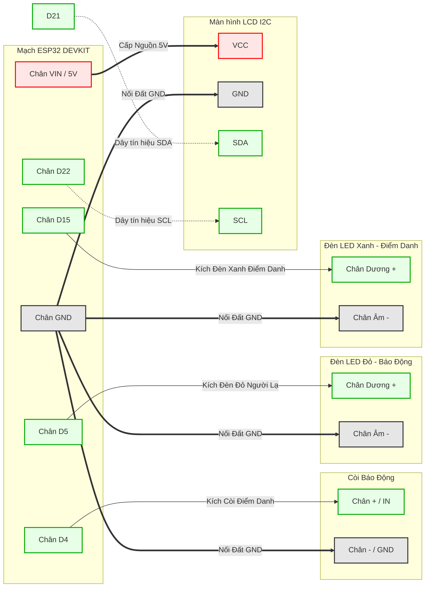

# SƠ ĐỒ ĐẤU DÂY PHẦN CỨNG ESP32 (IOT CAMERA)

Tài liệu này dành cho kỹ thuật viên lắp ráp phần cứng. Mạch sử dụng vi điều khiển **ESP32** (ví dụ: DOIT ESP32 DEVKIT V1) chạy ở mức logic 3.3V. 

---

## 1. Danh Sách Linh Kiện Cần Chuẩn Bị (Bill of Materials)

Dưới đây là bảng liệt kê đầy đủ các linh kiện phần cứng (trị giá tham khảo ~1.040.000đ) cần thiết để lắp ráp mạch điện cho dự án:

| STT | Tên Linh Kiện | Số Lượng | Ghi chú / Ứng dụng |
| :---: | :--- | :---: | :--- |
| 1 | **Webcam USB** | 1 | Cắm trực tiếp vào máy tính chạy Backend AI để lấy hình ảnh khuôn mặt. |
| 2 | **ESP32 Dev V1** | 1 | Vi điều khiển trung tâm (Bộ não IoT) nhận lệnh WiFi từ máy tính. |
| 3 | **Màn hình LCD 16x02** | 1 | (Kèm module I2C) Dùng để hiển thị chữ chào hỏi hoặc cảnh báo. |
| 4 | **Breakout ESP32** | 1 | Đế ra chân (Expansion Board) giúp cắm dây dễ dàng hơn, không cần hàn hàn. |
| 5 | **Dây nối, Nút nhấn, LED** | 1 bộ | Dây Dupont (Đực-Cái, Cái-Cái). Gồm 1 Đèn LED Đỏ (Cảnh báo) và 1 LED Xanh (Điểm danh). |
| 6 | **Còi Buzzer (Active)** | 1 | Loại 3.3V hoặc 5V. Dùng để kêu bíp báo hiệu thành công. |
| 7 | **Module Nguồn** | 1 | Mạch ổn áp/kích áp để đảm bảo dòng điện 5V ổn định cho hệ thống. |
| 8 | **Mạch Sạc** | 1 | Mạch sạc pin Lithium (vd: TP4056) bảo vệ quá dòng/quá áp. |
| 9 | **Pin Lithium** | 1 | Cấp nguồn không dây để mạch ESP32 hoạt động độc lập không cần cắm điện tường. |

---

## 2. Bản Đồ Trực Quan (Wiring Diagram)

Dựa theo danh sách linh kiện của bạn (KHÔNG sử dụng Rơ-le mở cửa, CHỈ sử dụng Màn hình hiển thị và Còi báo động). Sơ đồ dưới đây mô phỏng các đường dây nối từ mạch ESP32 đến các linh kiện. 
*(Gợi ý: Dùng dây Đỏ cho chân VIN/VCC và dây Đen cho chân GND để dễ phân biệt)*

---

## 2. Bảng Dò Chân (Pinout Mapping)

Nếu khó nhìn hình trên, bạn có thể xem bảng đối chiếu từng chân một ở đây:

| Tên Linh kiện | Chân trên Linh Kiện | Nối vào chân ESP32 | Ghi chú quan trọng |
| :--- | :--- | :--- | :--- |
| **Màn hình LCD 16x2 (I2C)** | VCC | **VIN (hoặc 5V)** | Bắt buộc cấp 5V thì màn hình mới sáng rõ. |
| | GND | **GND** | Nối chung mass toàn mạch. |
| | SDA | **D21** (GPIO 21) | Chân I2C Data mặc định của ESP32. |
| | SCL | **D22** (GPIO 22) | Chân I2C Clock mặc định của ESP32. |
| **Còi báo (Buzzer)** | IN / Tín hiệu (+) | **D4** (GPIO 4) | Chỉ kêu bíp ngắn khi ĐIỂM DANH THÀNH CÔNG. |
| | GND (-) | **GND** | |
| **Đèn LED Đỏ** | Chân Dương (+) | **D5** (GPIO 5) | Bật sáng liên tục 5 giây khi PHÁT HIỆN NGƯỜI LẠ. |
| | Chân Âm (-) | **GND** | |
| **Đèn LED Xanh** | Chân Dương (+) | **D15** (GPIO 15) | Bật sáng 2 giây khi ĐIỂM DANH THÀNH CÔNG. |
| | Chân Âm (-) | **GND** | |

---

## 3. Lưu Ý Dành Cho Kỹ Thuật Viên Lắp Ráp

1. **Màn hình LCD (I2C):** Sơ đồ này mặc định Màn hình LCD 16x2 của bạn đã được hàn sẵn một bo mạch chuyển đổi I2C màu đen ở mặt sau (Mạch này có 4 chân). Nếu LCD của bạn chỉ là thanh dài 16 chân mà không có mạch này, vui lòng báo lại ngay để cập nhật Code!
2. **Nút nhấn (trong danh sách vật tư):** Hiện tại hệ thống hoạt động hoàn toàn tự động dựa vào AI và điều khiển qua Webserver, nên Nút nhấn là KHÔNG CẦN THIẾT. Người lắp ráp có thể bỏ qua Nút nhấn này.
3. **Nguồn điện:** Hãy lấy nguồn 5V cho LCD từ chân `VIN` (ăn điện trực tiếp từ cổng USB). Không cắm vào chân `3V3` vì sẽ làm tối màn hình.
